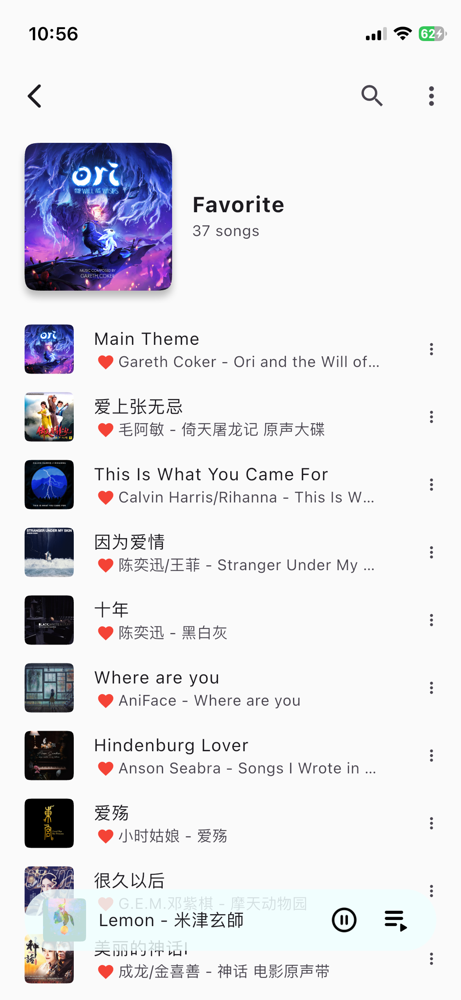
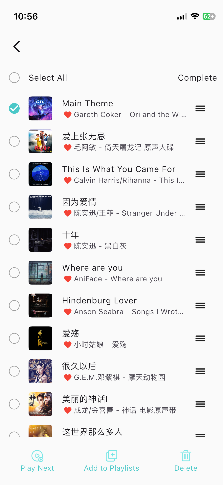
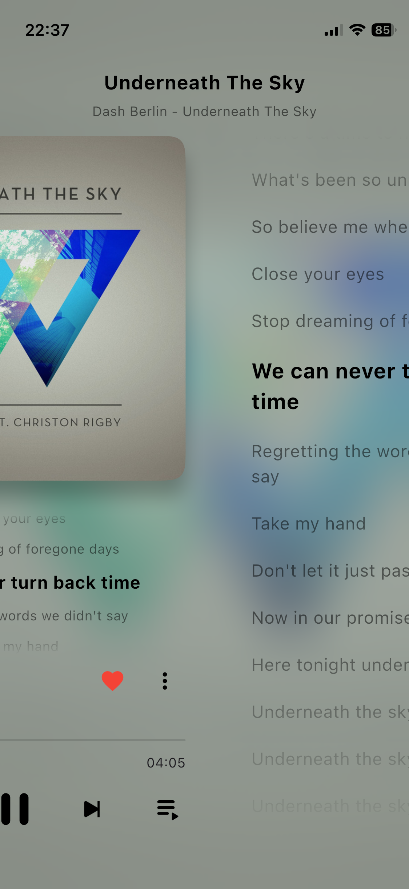
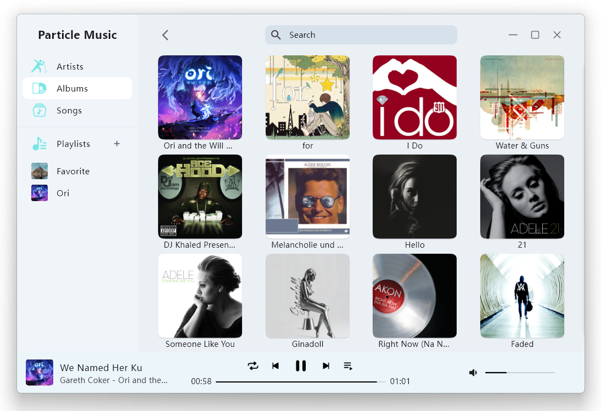
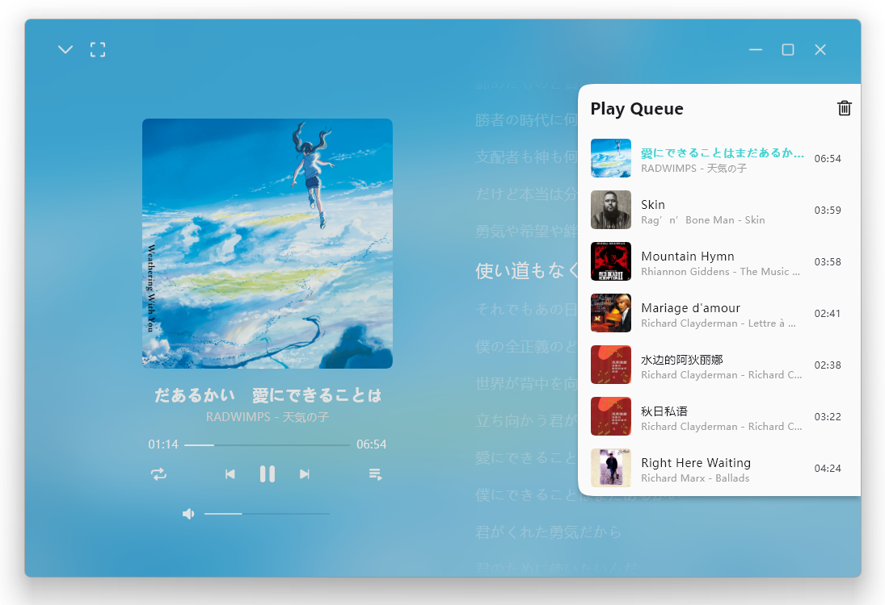

<div align="center">
    
</div>

# ParticleMusic

A cross-platform local music player supporting Android, iOS, Windows, Linux and macOS. This project is built for learning Flutter and having some fun.

## Run & Build
Install Flutter by following the [official Flutter installation guide](https://docs.flutter.dev/install/manual).
### Debian
``` shell
# Flutter dependencies:
sudo apt install clang cmake ninja-build pkg-config libgtk-3-dev liblzma-dev

# audio decoder lib for the ogg format
sudo apt install libvorbis-dev libopusfile-dev

git clone https://github.com/AfalpHy/ParticleMusic.git
cd ParticleMusic
# check the development environment
flutter doctor -v
# run in debug mode
flutter run
# run in release mode
flutter run --release
# build
flutter build linux
# if you want to generate a .deb package
flutter build linux && ./generate_deb.sh
```

### Windows
Install [Visual Studio](https://visualstudio.microsoft.com/).
```shell
git clone https://github.com/AfalpHy/ParticleMusic.git
cd ParticleMusic
# check the development environment
flutter doctor -v
# run in debug mode
flutter run
# run in release mode
flutter run --release
# build
flutter build windows
```

### macOS & iOS
Install Xcode and the Xcode Command Line Tools by following the [official Apple Developer download page](https://developer.apple.com/download/all/).

```shell
git clone https://github.com/AfalpHy/ParticleMusic.git
cd ParticleMusic

# install CocoaPods
sudo gem install cocoapods
# or
brew install cocoapods

# check the development environment
flutter doctor -v
# run in debug mode
flutter run
# run in release mode
flutter run --release
# build
flutter build macos

# build an unsigned ipa
flutter build ios --release --no-codesign && \
mkdir -p Payload && \
cp -r build/ios/iphoneos/Runner.app Payload/ && \
zip -r ParticleMusic.ipa Payload && \
rm -rf Payload
```

### Android
Install [Android Studio](https://developer.android.com/studio) and Android SDK Command-line Tools
```shell
git clone https://github.com/AfalpHy/ParticleMusic.git
cd ParticleMusic
# accept the SDK licenses
flutter doctor --android-licenses
# check the development environment
flutter doctor -v
# run in debug mode
flutter run
# run in release mode
flutter run --release
# build
flutter build apk
```
## Screenshots

### On iOS
<div>
    
    
    
</div>

<div>
    
    
    
</div>

<div>
    
    
    
</div>

### On Windows







