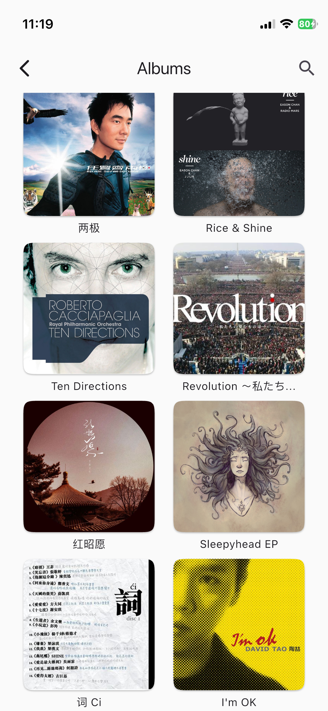
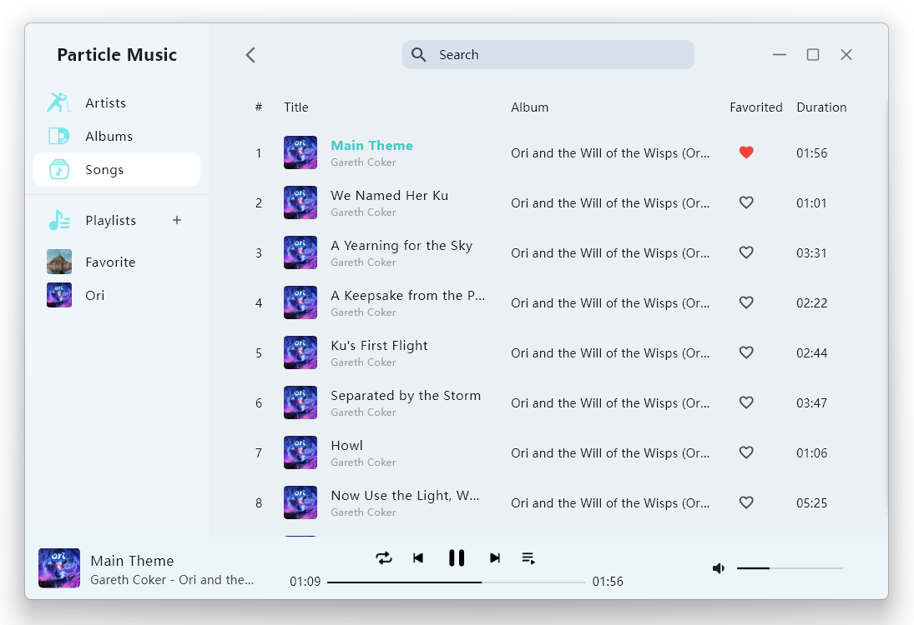
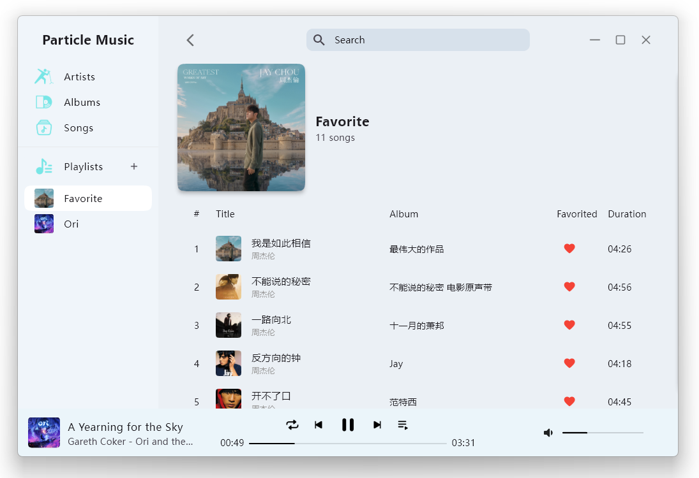

<div align="center">
    
</div>

# ParticleMusic

A cross-platform local music player supporting Android, iOS, Windows, Linux and macOS. This project is built for learning Flutter and having some fun.

## Supported Formats

| File Format | Metadata Format(s)           |
|-------------|------------------------------|
| AAC (ADTS)  | `ID3v2`, `ID3v1`             |
| Ape         | `APE`, `ID3v2`\*, `ID3v1`    |
| AIFF        | `ID3v2`, `Text Chunks`       |
| FLAC        | `Vorbis Comments`, `ID3v2`\* |
| MP3         | `ID3v2`, `ID3v1`, `APE`      |
| MP4         | `iTunes-style ilst`          |
| MPC         | `APE`, `ID3v2`\*, `ID3v1`\*  |
| Opus        | `Vorbis Comments`            |
| Ogg Vorbis  | `Vorbis Comments`            |
| Speex       | `Vorbis Comments`            |
| WAV         | `ID3v2`, `RIFF INFO`         |
| WavPack     | `APE`, `ID3v1`               |

\* The tag will be **read only**, due to lack of official support

## Audio Processing

- [audio_tags_lofty](https://github.com/AfalpHy/audio_tags_lofty.git) — for reading and writing audio tags (based on lofty)
- [media_kit](https://github.com/media-kit/media-kit.git) — for audio playback (based on mpv/FFmpeg)


## Run & Build
Install Flutter by following the [official Flutter installation guide](https://docs.flutter.dev/install/manual).
### Ubuntu/Debian
``` shell
# Flutter dependencies:
sudo apt install clang lld cmake ninja-build pkg-config libgtk-3-dev liblzma-dev

# audio lib
sudo apt install libmpv-dev

git clone https://github.com/AfalpHy/ParticleMusic.git
cd ParticleMusic
# check the development environment
flutter doctor -v
# run in debug mode
flutter run
# run in release mode
flutter run --release
# build
flutter build linux
# if you want to generate a .deb package
flutter build linux && ./generate_deb.sh
```

### Windows
Install [Visual Studio](https://visualstudio.microsoft.com/).
```shell
git clone https://github.com/AfalpHy/ParticleMusic.git
cd ParticleMusic
# check the development environment
flutter doctor -v
# run in debug mode
flutter run
# run in release mode
flutter run --release
# build
flutter build windows
```

### macOS & iOS
Install Xcode and the Xcode Command Line Tools by following the [official Apple Developer download page](https://developer.apple.com/download/all/).

```shell
git clone https://github.com/AfalpHy/ParticleMusic.git
cd ParticleMusic

# install CocoaPods
sudo gem install cocoapods
# or
brew install cocoapods

# check the development environment
flutter doctor -v
# run in debug mode
flutter run
# run in release mode
flutter run --release
# build
flutter build macos

# build an unsigned ipa
flutter build ios --release --no-codesign && \
mkdir -p Payload && \
cp -r build/ios/iphoneos/Runner.app Payload/ && \
zip -r ParticleMusic.ipa Payload && \
rm -rf Payload
```

### Android
Install [Android Studio](https://developer.android.com/studio) and Android SDK Command-line Tools
```shell
git clone https://github.com/AfalpHy/ParticleMusic.git
cd ParticleMusic
# accept the SDK licenses
flutter doctor --android-licenses
# check the development environment
flutter doctor -v
# run in debug mode
flutter run
# run in release mode
flutter run --release
# build
flutter build apk
```
## Screenshots

### On iOS
<div>
    
    
    
</div>

<div>
    
    
    
</div>

<div>
    
    
    
</div>

### On Windows






