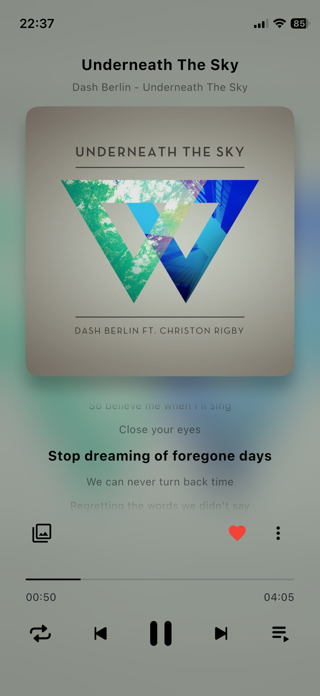

# ParticleMusic

A cross-platform music player supporting Android, iOS, Windows, Linux and MacOS. This project is built for learning Flutter and having some fun.

## Screenshot

### On iOS

    
    
    

    
    
    

### On Windows

